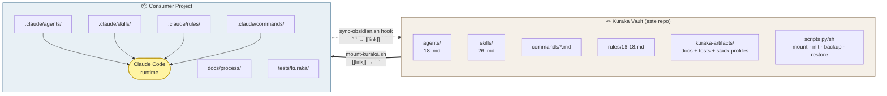
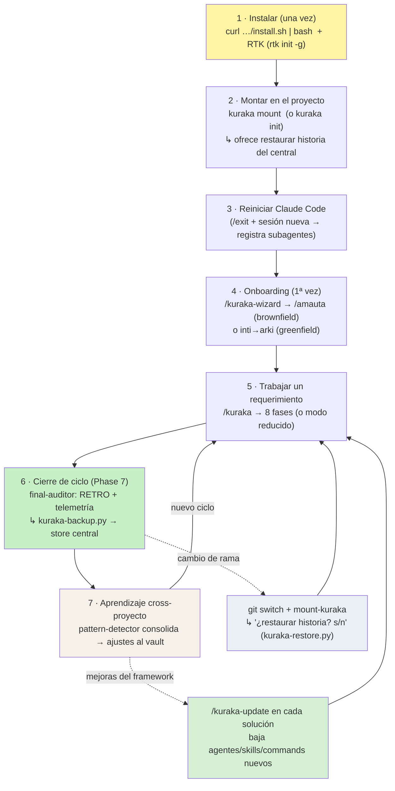
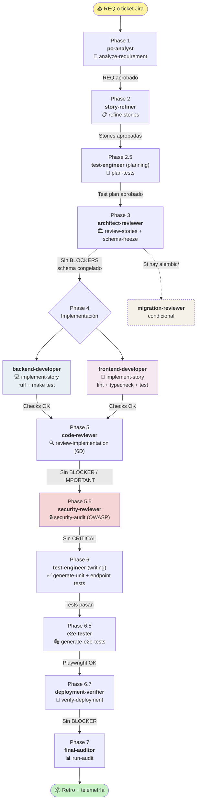
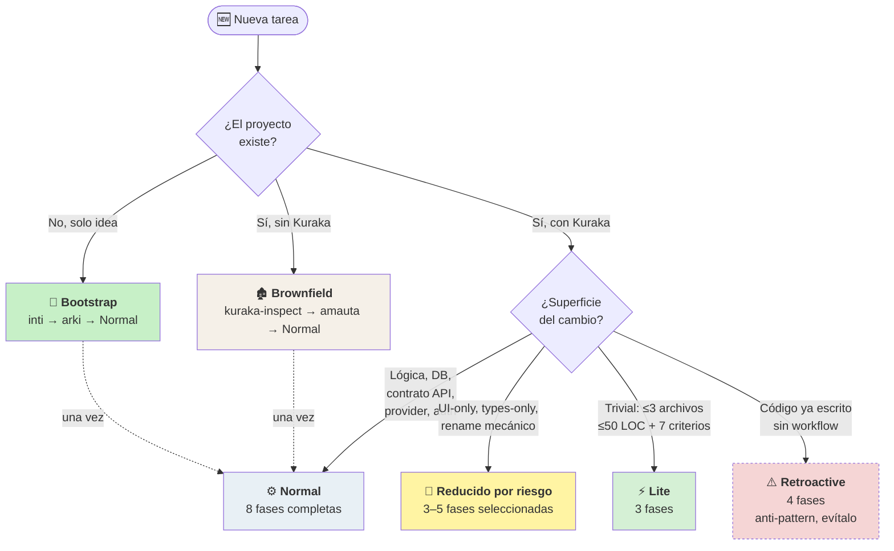

# Kuraka — Personal Development Agent System

> **Kuraka** (Quechua, *kuraq* = "el mayor"): líder local que coordinaba
> especialistas (quipucamayocs) bajo un plan mayor. Aquí es el orquestador de
> agentes de IA que dirigen el ciclo de desarrollo.

Sistema portable de agentes especializados para Claude Code. Se monta en
cualquier proyecto (nuevo o existente) mediante `mount-kuraka.sh`, detecta
stack con `kuraka-inspect.py`, y orquesta un workflow de 8 fases con 18
agentes. Reduce ~55% de tokens por ciclo vs. un workflow ingenuo (y más con
RTK activo: 70–90% en operaciones de dev).

**Lo que aporta el diseño actual:**
- **Aprendizaje cross-proyecto**: cada ciclo audita (RETRO) y se respalda al
  vault central; `pattern-detector` consolida si un fallo es de un proyecto o
  de todos, y se ajustan los agentes/skills base (las "4 olas" de optimización —
  ver `KURAKA-OPTIMIZATION-REPORT.md`).
- **Store central unificado** (`projects/<slug>/`): conserva la historia de
  Kuraka de cada proyecto **fuera del git de la solución**; al cambiar de rama
  se restaura sin perder nada (`kuraka-backup.py` / `kuraka-restore.py`).
- **Componentes recomendados** (RTK, ui-ux-pro-max, Playwright MCP…) que el
  instalador sugiere y detecta — ver `RECOMMENDED-COMPONENTS.md`.

---

## Arquitectura: vault ↔ proyecto

El repo Kuraka es un **vault** (fuente de la verdad). No contiene código de
aplicación — contiene las definiciones de agentes, skills, commands y rules
que se *montan* en cualquier proyecto consumidor.



- **Flecha sólida** (`mount-kuraka.sh`): copia del vault al proyecto, convierte
  wikilinks de Obsidian `[[name]]` → backticks `` `name` `` que Claude Code espera.
- **Flecha punteada** (`sync-obsidian.sh` via hook): reversión al vault, con
  guard del 80% para evitar pisar el baúl si el `.claude/` del proyecto está
  incompleto (p.ej. tras un `git switch`).
- `commands/*.md` se copia verbatim en ambos sentidos — nunca usa wikilinks.

---

## Instalación rápida (one-shot, estilo `rtk init`)

**Equipo nuevo — UN solo comando** (clona + instala el CLI):

```bash
curl -fsSL https://raw.githubusercontent.com/xaman1990/kuraka/main/install.sh | bash
#   (para elegir carpeta:  ... | bash -s -- ~/dev/kuraka )
```

Eso clona el vault en `~/.kuraka`, setea `KURAKA_VAULT` y deja el comando
`kuraka` en el PATH. Abrí una terminal nueva (o `source ~/.zshrc`) y listo.

Luego, desde cualquier solución:

```bash
# (recomendado) RTK — ahorra 70–90% de tokens, hook transparente
brew install rtk && rtk init -g

cd /ruta/a/mi-proyecto
kuraka mount            # monta acá   (o:  kuraka mount /otra/ruta)
#   ↳ si el central ya tiene historia de este proyecto, te ofrece restaurarla
# reiniciá Claude Code (/exit + sesión nueva) para registrar los subagentes
```

> Si preferís clonar a mano: `git clone --recurse-submodules
> https://github.com/xaman1990/kuraka.git ~/.kuraka && ~/.kuraka/install.sh`
> (el mismo `install.sh` detecta el clon y no vuelve a descargar).

Esto reemplaza el flujo viejo (entrar al vault, abrir Claude ahí, indicar dónde
montar). Ahora `kuraka mount` se llama **desde la solución** (o con la ruta como
argumento). `kuraka doctor` verifica el setup.

```text
kuraka mount [dir]     montar/actualizar aquí (o en dir)
kuraka init  [dir]     instalación completa (inspect+config+skeleton+mount+registro)
kuraka update          actualizar el framework del proyecto actual
kuraka backup|restore  respaldar / restaurar historia contra el store central
kuraka inspect|discover|dashboard|validate|doctor
```

> Para una instalación guiada del proyecto (config + capa `.claude/project` desde
> el código real), `kuraka init` corre inspect + config + skeleton + mount +
> registro y al final **lista los componentes recomendados y detecta cuáles ya
> tenés** (RTK se detecta solo; skills/MCP como ui-ux-pro-max se instalan desde el
> marketplace de plugins de Claude Code).

> **Fallback manual** (sin `install.sh`): `export KURAKA_VAULT="$HOME/.kuraka"` en
> `~/.zshrc` y usá los scripts directo (`bash $KURAKA_VAULT/mount-kuraka.sh <dir>`).

---

## Flujo de uso completo (ciclo de vida)



| Paso | Qué corre | Resultado |
|------|-----------|-----------|
| 1. Instalar (una vez) | `curl -fsSL …/install.sh \| bash`, `rtk init -g` | clona el vault + CLI `kuraka` en el PATH + `KURAKA_VAULT` seteado + ahorro de tokens activo |
| 2. Montar | `kuraka mount` (o `kuraka init`) desde la solución | copia el framework al `.claude/` del proyecto; si hay historia en el central, **ofrece restaurarla** |
| 3. Reiniciar | `/exit` + sesión nueva | Claude Code registra los subagentes/commands |
| 4. Onboarding | `/kuraka-wizard` → `/amauta` (o `inti`/`arki`) | `kuraka.config.yaml` + `.claude/project/` desde el código real |
| 5. Ciclo | `/kuraka` | feature implementada con las 8 fases (o el modo que toque) |
| 6. Cierre | `final-auditor` (Phase 7) | RETRO + telemetría + **backup al store central** (`kuraka-backup.py`) |
| 7. Aprendizaje | `pattern-detector` / `/kuraka-update` | consolida fallos cross-proyecto → ajusta el vault → baja a las soluciones |

**Persistencia fuera del git de la solución:** vos commiteás solo tu código
fuente; lo de Kuraka (REQ, stories, schemas, capa `.claude/project`, RETROs)
queda en el `.claude/`/`docs/process` del proyecto (gitignored) **y** respaldado
en el store central. Al cambiar/crear rama, `mount-kuraka` detecta la historia y
te ofrece re-pegarla — así no se pierde nada aunque nunca subas Kuraka a git.

---

## Componentes

### Agentes (`agents/`, 18 en total)

**Workflow core (13)**:
- `po-analyst` — Phase 1: análisis de requerimiento
- `story-refiner` — Phase 2: refinamiento de stories con AC verificables
- `test-engineer` — Phase 2.5 + Phase 6: test planning + test writing
- `architect-reviewer` — Phase 3: review de stories + schema freeze
- `backend-developer`, `frontend-developer` — Phase 4
- `code-reviewer` — Phase 5: review 6D
- `security-reviewer` — Phase 5.5: OWASP + tenant + auth
- `e2e-tester` — Phase 6.5: Playwright golden path
- `deployment-verifier` — Phase 6.7: docker/env/CI checks
- `final-auditor` — Phase 7: retrospectiva + telemetry
- `migration-reviewer`, `pattern-detector` — conditional

**Bootstrap (3)**:
- `amauta` — brownfield onboarding (lee inspect + muestrea código → genera rules/docs)
- `inti` — greenfield discovery (entrevista → vision + requirements)
- `arki` — greenfield architecture (discovery → stack proposal + scaffolding)

**Seguridad / remediación (2)**:
- `checkmarx-remediation` — abre Checkmarx (Playwright), confirma findings SAST/SCA y remedia
- `pentest-auditor` — auditoría de pentest sobre el cambio

**Model routing**: opus (juicio), sonnet (impl/balanced), haiku (mecánico).

### Skills (`skills/`)

- `kuraka.md` — flujo principal y phase map
- `kuraka-modes.md` — variantes (Bootstrap, Brownfield, Lite, Retroactive, Reducido)
- `kuraka-policies.md` — retry, timeout, telemetry, checkpointing, tooling
- Skills específicos por fase (`analyze-requirement`, `implement-story`, etc.)

### Scripts

| Script | Función |
|---|---|
| `install.sh` | **Setup de máquina (una vez)**: registra `KURAKA_VAULT` + pone el CLI `kuraka` en el PATH |
| `kuraka` | **CLI único**: `mount`/`init`/`update`/`backup`/`restore`/`inspect`/`discover`/`dashboard`/`validate`/`doctor` |
| `kuraka-init.py` | **Instalador one-shot de proyecto**: inspect → config → skeleton → mount → registro + recomienda componentes |
| `mount-kuraka.sh` | Monta el Kuraka en un proyecto (rsync + gitignore) y **ofrece restaurar historia** del central |
| `kuraka-backup.py` | Snapshot del estado Kuraka del proyecto → store central (`layer`+`state`+`cycles`, etiqueta rama) |
| `kuraka-restore.py` | Restaura la historia del central → proyecto (pregunta; no pisa sin `--force`) |
| `kuraka-export.py` | Genera `AGENTS.md` (+ `.cursor/rules`) para Codex/Cursor/Antigravity (`kuraka mount --target …`) |
| `kuraka-archive.py` | Archiva solo los diagnósticos de ciclo (wrapper cycles-only de backup) |
| `kuraka-discover.py` | Descubre proyectos montados en disco y reconcilia el registro |
| `validate-kuraka.sh` | Valida frontmatter de agentes/skills + refs huérfanas |
| `kuraka-inspect.py` | Detector de stack (backend/frontend/DB/testing/CI/containers, monorepo) |
| `aggregate-telemetry.py` | Dashboard agregado de tokens/tiempo multi-ciclo (compute vs wall-clock) |
| `kuraka_common.py` | Módulo compartido: identidad única (`project_slug`) + rutas del store |

### Rules personales (`rules/`)

Solo las meta-reglas del sistema Kuraka:
- `16-agent-backup.md` — sync a Obsidian vault / backup
- `17-kuraka-token-optimizations.md` — patrones T1–T8 de ahorro de tokens
  (digest, end-only typecheck, mapping-table, gate-integrity, fix-run/reviewer digest…)
- `18-duplication-aware-refactor.md` — refactor consciente de duplicación

Las reglas 01–15 son convenciones de código **específicas del proyecto** y
viven en el git del proyecto, no aquí.

### Artifacts (`kuraka-artifacts/`)

Restaurados a cualquier proyecto via `mount-kuraka.sh`:
- `stack-profiles/` — guía idiomática por stack (`python-fastapi`, `vue-pinia`,
  `angular`, `express`, `react`) + `_template.md` para nuevos
- `docs/process/lessons-learned.md` — lecciones indexadas como `[LL-NNN]`
- `docs/process/agent-telemetry/DASHBOARD.md` — plantilla del dashboard
- `tests/kuraka/` — suite pytest de validación estructural

### Componentes recomendados (`RECOMMENDED-COMPONENTS.md`)

Kuraka funciona sin ellos, pero rinden mucho mejor con:

| Componente | Prioridad | Quién lo usa | Para qué |
|---|:--:|---|---|
| **RTK** (rtk-ai/rtk) | 🔴 | todos los agentes | proxy CLI por hook transparente; 70–90% menos tokens en bash/test/grep |
| **ui-ux-pro-max** | 🟡 | `frontend-developer` | inteligencia de diseño UI/UX |
| **Playwright MCP** | 🟡 | `e2e-tester`, `checkmarx-remediation` | tests de navegador + login en vivo |
| **impeccable** | ⚪ | frontend | auditoría/pulido visual |

`kuraka-init.py` los lista y detecta al instalar. RTK se activa con `rtk init -g`
(hook global) — sin cablear nada en los agentes. Para chequeos byte-exactos de
contrato los agentes usan `rtk proxy <cmd>` (salida cruda, sin truncar).

---

## Flujo Normal: las 8 fases

Ciclo de desarrollo por defecto en proyectos con Kuraka ya montado. Cada fase
tiene un **gate** (aprobación del usuario o checks en verde) antes de avanzar —
el orquestador nunca auto-avanza.



**Model routing por fase**: `opus` para juicio (po-analyst, architect-reviewer,
code-reviewer, security-reviewer, final-auditor), `sonnet` para implementación,
`haiku` para mecánico (pattern-detector).

---

## Modos del workflow

No todos los cambios requieren las 8 fases. El Kuraka escala el pipeline al
riesgo real del cambio — decisión **antes** de invocar ningún agente:



| Modo | Cuándo | Fases |
|------|--------|:-----:|
| **Discovery** (Design-Thinking) | Solo una idea, sin requerimiento aún | `facilitate-discovery` (concejo Tinkuy) → po-analyst / inti |
| **Bootstrap** | Proyecto nuevo (solo idea) | `inti` → `arki` → Normal |
| **Brownfield** | Proyecto existente sin Kuraka | `kuraka-inspect` → `amauta` → Normal |
| **Normal** | Cambio en proyecto con Kuraka | 8 fases |
| **Reducido por riesgo** | Cambio estrecho (UI-only, rename, types) | 3–5 fases |
| **Lite** | Trivial (≤ 3 archivos, ≤ 50 LOC, 7 criterios más) | 3 fases |
| **Retroactive** | Código ya implementado (anti-pattern) | 4 fases |

Detalle de criterios y templates por modo en `skills/kuraka-modes.md`.

---

## Comandos slash (dentro del proyecto)

Una vez montado Kuraka y reiniciado Claude Code, estos comandos quedan
disponibles en `.claude/commands/`. Todos son **portables**: resuelven el
vault desde `$KURAKA_VAULT` (con respaldo) y detectan la raíz del proyecto
buscando `.claude/` hacia arriba, así funcionan en cualquier máquina y desde
cualquier subdirectorio.

| Comando | Para qué |
|---|---|
| `/kuraka-wizard` | **Asistente de arranque.** Detecta el estado (montado, config, código, greenfield/brownfield) y ejecuta o encamina el siguiente paso correcto. Re-ejecutable: cada corrida avanza una etapa y para limpio en los puntos de reinicio. |
| `/amauta` | **Mapea un proyecto existente** (brownfield) en un paso: corre `kuraka-inspect` si falta y luego invoca al agente `amauta` para generar `kuraka.config.yaml` + `.claude/project/` extrayendo convenciones del código real. |
| `/kuraka-update` | **Actualiza el framework montado** en este proyecto desde el vault (nuevos agentes/skills/commands/templates). No toca `kuraka.config.yaml`, `.claude/project/` ni `docs/`. |
| `/kuraka-backup` | **Acomoda el proyecto al store central**: snapshotea su estado Kuraka completo (`layer`+`state`+`cycles`) a `projects/<slug>/` del vault. Correr tras `/kuraka-update`; Phase 7 lo corre solo en cada cierre. |
| `/kuraka` | Orquesta un ciclo de desarrollo para un requerimiento dado. |

> **Importante**: tras `/kuraka-update` (o cualquier mount) hay que reiniciar
> Claude Code (`/exit` + sesión nueva) — agentes, skills y commands se
> registran solo al inicio de sesión.

### Onboarding paso a paso (proyecto existente)

```bash
# 1. Desde la solución (repo recién clonado, sin nada montado):
cd /ruta/al/proyecto
kuraka init        # inspect + config + skeleton + mount + registro + componentes
#   …o solo el mount:  kuraka mount

# 2. Reinicia Claude Code en el proyecto (/exit + sesión nueva)

# 3. En la sesión nueva, deja que el wizard te guíe:
/kuraka-wizard        # → detecta brownfield-sin-config → invoca amauta
#   (o directo: /amauta)

# 4. Aprueba la matriz de convenciones de amauta y resuelve los <TODO>.
#    El proyecto queda listo para /kuraka o para Discovery.
```

### Actualizar un proyecto que ya tenía Kuraka

```bash
cd /ruta/al/proyecto
kuraka update         # trae lo nuevo del vault (rsync --update) → reinicia Claude Code
# (equivalente dentro de Claude Code: /kuraka-update)
```

> **Portabilidad entre máquinas**: el único ajuste por equipo es una línea en
> `~/.zshrc`: `export KURAKA_VAULT="/ruta/donde/clonaste/kuraka"`. Con eso,
> `mount-kuraka.sh`, el alias y todos los comandos slash apuntan al lugar
> correcto. Si no está, caen al respaldo y, si no existe, te avisan en vez de
> fallar en silencio.

---

## Modo Discovery (Design-Thinking — Tinkuy)

Cuando tienes una **idea, no un requerimiento** ("quiero un software de
contabilidad") y quieres discutir las bases del sistema con expertos de
dominio **antes** de definir nada. Es el front-end difuso que se sienta
*antes* de `po-analyst`.

**Cómo se usa**: en la sesión del proyecto, simplemente plantea la idea:

```
Tengo una idea, no un requerimiento todavía: {tu idea}.
Quiero discutir las bases con expertos antes de definir nada.
```

El orquestador corre la skill `facilitate-discovery` (concejo Tinkuy):

1. **D1** — clasifica el dominio y propone 2–4 expertos (p.ej. contador +
   admin-finanzas + un escéptico/usuario). Apruebas el concejo.
2. **D2** — convoca un panel **efímero** (subagentes desechables, **sin
   reinicio**) y corre rondas diverge/converge; conversas con ellos a través
   del facilitador, que sintetiza y te devuelve los conflictos.
3. **D3** — sintetiza `docs/discovery/design-brief-{slug}.md`.
4. **D4** (opcional) — **promueve** los expertos valiosos a agentes
   permanentes en `.claude/project/agents/` (un reinicio los registra).

**Híbrido por diseño**: el panel arranca efímero (cero fricción) y solo los
expertos que valga la pena se vuelven permanentes y reutilizables.

**Guardas**: 2–4 expertos, 2 rondas por defecto, síntesis obligatoria, y todo
reclamo regulatorio/legal/normativo se marca `⚠️ VALIDAR con experto humano`
(el concejo razona sobre estructura, no es fuente de verdad para NIIF/IFRS,
ley tributaria, etc.). El brief alimenta luego a `po-analyst` (proyecto
existente) o a `inti`/`arki` (greenfield). Detalle en
`skills/facilitate-discovery.md`.

---

## Otros entornos de IA (Codex, Cursor, Antigravity)

Kuraka da su orquestación multi-subagente completa en **Claude Code**. Para otros
entornos, `mount` genera la versión **portable** del workflow vía `AGENTS.md` (el
estándar que leen Codex, Cursor, Antigravity, Gemini CLI…):

```bash
kuraka mount --target codex        # genera AGENTS.md en la raíz del proyecto
kuraka mount --target cursor       # AGENTS.md + .cursor/rules/kuraka.mdc
kuraka mount --target antigravity  # AGENTS.md (verificar reglas propias del IDE)
kuraka mount                        # (default) Claude Code → .claude/ completo
```

Qué porta y qué no:
- **Porta** (como guía): la disciplina de 8 fases con gates, los no-negociables
  (observar contratos, schema freeze, "green = lint+typecheck+test", green ≠
  working), las convenciones del stack y cada agente convertido en un **rol** que
  el agente único adopta por fase.
- **No porta**: el *fan-out automático* de subagentes (es propio del tool `Task`
  de Claude Code). En esos entornos los roles se invocan manualmente.
- **RTK** sí funciona en todos (Cursor, Codex, Gemini CLI…): corré su `rtk init`
  y el ahorro de tokens aplica igual.

El `AGENTS.md` se regenera con re-correr el comando; toma el stack/convenciones de
`kuraka.config.yaml` y los roles de los agentes del vault.

---

## Store central + backup/restore (historia fuera del git de la solución)

Toda la historia de Kuraka de cada proyecto vive en **un solo directorio** del
vault, `projects/<slug>/` (fusión de los antiguos `cycle-archive/` y
`projects-docs/`):

```
projects/
├── README.md                 (doc)        INDEX.md (catálogo de ciclos)
└── <slug>/                    slug = kuraka.config.yaml project.name (canónico)
    ├── registry.md           ficha: path, stack, modo, status
    ├── backup.yaml           last_backup, last_branch, branches[]
    ├── layer/                snapshot de .claude/project/ (convenciones, lessons, review-checks)
    ├── state/docs-process/   snapshot de docs/process/ (REQ, stories, test-plans, schemas, checkpoints)
    └── cycles/<REQ>/          RETRO + telemetry + meta (diagnósticos por ciclo)
```

- **Identidad única**: el slug sale del `project.name` del config vía
  `kuraka_common.project_slug`, usado por init/backup/restore/archive/discover —
  un proyecto tiene **un solo nombre** en todas las herramientas.
- **Backup** (`kuraka-backup.py`): automático en Phase 7 y on-demand
  (`/kuraka-backup`). Etiqueta la rama en cada ciclo.
- **Restore** (`kuraka-restore.py`): al montar/cambiar de rama, `mount-kuraka`
  pregunta *"¿restauro la historia de `<slug>`?"* y re-pega `layer/` + `state/`
  **sin pisar** lo existente (`--force` para sobrescribir).
- **Aprendizaje cross-proyecto**: `pattern-detector` lee todos los
  `projects/*/cycles/**` para detectar fallos sistémicos (de todos los proyectos,
  no de uno solo) y proponer ajustes al vault base.
- **Política de git**: el store es **solo disco** (`projects/` está gitignored).
  Sobrevive a los cambios de rama de la solución; no se sube con el vault.

**Caso de uso clave** — no perder trabajo al cambiar de rama:

```bash
# Trabajaste en rama-A con Kuraka (REQ, stories, schemas) y NO lo subiste a git.
git switch rama-B          # o git switch -c rama-nueva
mount-kuraka               # detecta historia en el central →
                           #   "¿Restaurar la historia de <slug>? [s/N]"  → s
# todo el histórico vuelve a rama-B; seguís donde quedaste.
```

---

## Qué NO está en este repo

- **Reglas 01–15** del proyecto sie_v2 (convenciones de equipo, viven en el git del proyecto)
- **Código de aplicación** de ningún proyecto consumidor — **excepto el Control Plane**
  (`kuraka-control/`), que es la app oficial para gobernar el framework y se distribuye
  como **submódulo git** ([repo](https://github.com/xaman1990/kuraka-control)). Se construye
  *con* Kuraka (dogfood) y gobierna *a* Kuraka (hub-and-spoke).
- **REQs, stories, retros** de ciclos específicos (esos viven en el `kipus/` de cada proyecto)

---

## Estado del arte

Baseline medido en el ciclo 2026-04-21 (homologate-new-scale-frontend):
**458K tokens** para restyle de 7 archivos en 3 fases.

Con los patrones T1–T8 aplicados + model routing + agentes nativos registrados:
proyección **~200K tokens** por ciclo equivalente (−55%). Con **RTK** activo
(hook global) se suma 70–90% de ahorro en operaciones de dev (grep/cat/test/git),
complementario a las reglas T (ellas reducen *cuántas veces* leés; RTK reduce el
*costo de cada lectura*).

**Optimización continua basada en datos**: el análisis cross-proyecto de 38
retrospectivas produjo 14 hallazgos comunes y 4 "olas" de mejoras ya aplicadas a
los agentes/skills/rules base (`KURAKA-OPTIMIZATION-REPORT.md`). El loop se
auto-sostiene: `final-auditor` verifica que los parches de la retro anterior se
aplicaron, y `pattern-detector` se auto-dispara cada 5 ciclos.

Telemetría continua vía `aggregate-telemetry.py` (separa compute de wall-clock).

---

## Licencia

Uso personal. Compartible con el equipo bajo acuerdo.

---

*Última revisión: 2026-06-28 (store central unificado `projects/<slug>/` + backup/restore branch-aware [`kuraka-backup.py`/`kuraka-restore.py`/`kuraka_common.py`, comando `/kuraka-backup`]; 4 olas de optimización de agentes/skills/rules desde retros cross-proyecto [`KURAKA-OPTIMIZATION-REPORT.md`]; componentes recomendados + RTK [`RECOMMENDED-COMPONENTS.md`]; agentes de seguridad checkmarx-remediation + pentest-auditor [18 agentes]; stack-profiles angular/express/react)*
*Last synced: 2026-06-04 (session: 4 Mutua Kuraka cycles — nuevoaviso contract/idServicio, outbound handler-rename+e2e, outbound payload §2.6/§2.11 vs PDF, keycloak fallback removal — + RECURRING-ISSUES.md agent-optimization analysis. RETROs, REQs, SMOKE, PENDING synced. Agent prompt patches NOT yet applied — pending user review of RECURRING-ISSUES.md.)*
*Last synced: 2026-06-10 (project `clinicaDental2026` (ZYNVET, Angular 19) added to `projects/clinicaDental2026.md` after REQ-20260610-vet-pets Cycle 1 — project-layer patches P1–P5 applied in-repo: review-checks verbatim-payload-fidelity / binding-pitfall-snippets / directed-contract-crosscheck, conventions NG0203 guard, agent appends, lessons LL-001/LL-002.)*
*Last synced: 2026-06-11 (GuaiHome RETRO-REQ-20260611-mvp1-registro-perito-webhook §6 patches applied — only `skills/kuraka-policies.md` synced here (P2 framework part: "Gate command integrity" no-pipe gate rule). P1/P3/P4/P5/P6/T7/T8 are `.claude/project/` + `.claude/rules/` files, OUTSIDE the backup mapping → applied local-only in-repo, not synced.)*
*Last synced: 2026-06-15 (project `wacertificadonodeudor` (Yanbal Certificado No Deudor, ASP.NET MVC 5 / .NET Framework 4.8, EF6 database-first, WCF/SOAP) mapped by `amauta` — registry card `projects/wacertificadonodeudor.md` updated from init stub (stack/conventions/risks/TODOs, confidence 0.85). Its `.claude/project/` layer + `kuraka.config.yaml` are in-repo only (OUTSIDE the backup mapping → not mirrored to vault `docs/`); the rule-16 `docs/` rsync was deliberately NOT run — that target is the framework's own docs and `--delete` with this project's skeleton would have clobbered it.)*
*Last synced: 2026-06-16 (GuaiHome RETRO-REQ-20260616-DD-perito-webhook-audit §6 patches applied — framework agents synced: `agents/story-refiner.md` (P2: size existing functions before adding wiring → pre-authorize named extraction in AC), `agents/backend-developer.md` + `agents/frontend-developer.md` (P3: "Reporting Deviations" — announce + rationale + path-back, never substitute silently). P1 is `.claude/project/lessons-learned.md` (Postgres-only type → SQLite create_all blast radius) — in-repo only, OUTSIDE backup mapping. P4 (CI/CD) not applied per user.)*

*Last synced: 2026-06-25 (bol-cert-no-deudor Checkmarx Low-closure cycle — scan `fee9e7d8`, 5 SAST Low confirmed, SCA=0, API Sec ⊂ SAST. Only `docs/process/checkmarx/` changed → mirrored that subfolder ONLY (md+json+html, scoped `--delete`); the project-wide `docs/` rsync was deliberately NOT run since vault `docs/` is shared and `--delete` would clobber other projects. New: PR-E section in checklist/remediacion/estimacion/inventario, `PR-E5-justificacion-not-exploitable.md`, raw `cx-*.low.json`. Agent + command `checkmarx-remediation.md` verified in-sync (unchanged this cycle).)*
