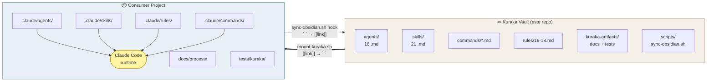

# Kuraka — Personal Development Agent System

> **Kuraka** (Quechua, *kuraq* = "el mayor"): líder local que coordinaba
> especialistas (quipucamayocs) bajo un plan mayor. Aquí es el orquestador de
> agentes de IA que dirigen el ciclo de desarrollo.

Sistema portable de agentes especializados para Claude Code. Se monta en
cualquier proyecto (nuevo o existente) mediante `mount-kuraka.sh`, detecta
stack con `kuraka-inspect.py`, y orquesta un workflow de 8 fases con 16
agentes. Reduce ~55% de tokens por ciclo vs. un workflow ingenuo.

---

## Arquitectura: vault ↔ proyecto

El repo Kuraka es un **vault** (fuente de la verdad). No contiene código de
aplicación — contiene las definiciones de agentes, skills, commands y rules
que se *montan* en cualquier proyecto consumidor.



- **Flecha sólida** (`mount-kuraka.sh`): copia del vault al proyecto, convierte
  wikilinks de Obsidian `[[name]]` → backticks `` `name` `` que Claude Code espera.
- **Flecha punteada** (`sync-obsidian.sh` via hook): reversión al vault, con
  guard del 80% para evitar pisar el baúl si el `.claude/` del proyecto está
  incompleto (p.ej. tras un `git switch`).
- `commands/*.md` se copia verbatim en ambos sentidos — nunca usa wikilinks.

---

## Instalación rápida

```bash
# clonar el repo (solo la primera vez, en cualquier máquina)
git clone <url-del-repo> ~/.kuraka

# alias en ~/.zshrc
echo 'alias mount-kuraka="bash ~/.kuraka/mount-kuraka.sh"' >> ~/.zshrc
echo 'alias validate-kuraka="bash ~/.kuraka/validate-kuraka.sh"' >> ~/.zshrc
echo 'alias kuraka-inspect="python3 ~/.kuraka/kuraka-inspect.py"' >> ~/.zshrc
echo 'alias kuraka-dashboard="python3 ~/.kuraka/aggregate-telemetry.py"' >> ~/.zshrc

# uso en un proyecto
cd /ruta/a/mi-proyecto
mount-kuraka          # monta agentes, skills, rules personales, tests, gitignore
/exit                  # reinicia Claude Code para que registre los subagentes
# nueva sesión: el Kuraka ya está disponible
```

---

## Componentes

### Agentes (`agents/`, 16 en total)

**Workflow core (13)**:
- `po-analyst` — Phase 1: análisis de requerimiento
- `story-refiner` — Phase 2: refinamiento de stories con AC verificables
- `test-engineer` — Phase 2.5 + Phase 6: test planning + test writing
- `architect-reviewer` — Phase 3: review de stories + schema freeze
- `backend-developer`, `frontend-developer` — Phase 4
- `code-reviewer` — Phase 5: review 6D
- `security-reviewer` — Phase 5.5: OWASP + tenant + auth
- `e2e-tester` — Phase 6.5: Playwright golden path
- `deployment-verifier` — Phase 6.7: docker/env/CI checks
- `final-auditor` — Phase 7: retrospectiva + telemetry
- `migration-reviewer`, `pattern-detector` — conditional

**Bootstrap (3)**:
- `amauta` — brownfield onboarding (lee inspect + muestrea código → genera rules/docs)
- `inti` — greenfield discovery (entrevista → vision + requirements)
- `arki` — greenfield architecture (discovery → stack proposal + scaffolding)

**Model routing**: opus (juicio), sonnet (impl/balanced), haiku (mecánico).

### Skills (`skills/`)

- `kuraka.md` — flujo principal y phase map
- `kuraka-modes.md` — variantes (Bootstrap, Brownfield, Lite, Retroactive, Reducido)
- `kuraka-policies.md` — retry, timeout, telemetry, checkpointing, tooling
- Skills específicos por fase (`analyze-requirement`, `implement-story`, etc.)

### Scripts

| Script | Función |
|---|---|
| `mount-kuraka.sh` | Monta el Kuraka en un proyecto (rsync + gitignore + restore de artifacts) |
| `validate-kuraka.sh` | Valida frontmatter de agentes/skills + refs huérfanas |
| `kuraka-inspect.py` | Detector de stack (backend/frontend/DB/testing/CI/containers) |
| `aggregate-telemetry.py` | Dashboard agregado de tokens/tiempo multi-ciclo |

### Rules personales (`rules/`)

Solo las meta-reglas del sistema Kuraka:
- `16-agent-backup.md` — sync a Obsidian vault
- `17-kuraka-token-optimizations.md` — patrones T1–T5 de ahorro de tokens

Las reglas 01–15 son convenciones de código **específicas del proyecto** y
viven en el git del proyecto, no aquí.

### Artifacts (`kuraka-artifacts/`)

Restaurados a cualquier proyecto via `mount-kuraka.sh`:
- `docs/process/lessons-learned.md` — lecciones indexadas como `[LL-NNN]`
- `docs/process/agent-telemetry/DASHBOARD.md` — plantilla del dashboard
- `tests/kuraka/` — suite pytest de validación estructural

---

## Flujo Normal: las 8 fases

Ciclo de desarrollo por defecto en proyectos con Kuraka ya montado. Cada fase
tiene un **gate** (aprobación del usuario o checks en verde) antes de avanzar —
el orquestador nunca auto-avanza.


**Model routing por fase**: `opus` para juicio (po-analyst, architect-reviewer,
code-reviewer, security-reviewer, final-auditor), `sonnet` para implementación,
`haiku` para mecánico (pattern-detector).

---

## Modos del workflow

No todos los cambios requieren las 8 fases. El Kuraka escala el pipeline al
riesgo real del cambio — decisión **antes** de invocar ningún agente:


| Modo | Cuándo | Fases |
|------|--------|:-----:|
| **Bootstrap** | Proyecto nuevo (solo idea) | `inti` → `arki` → Normal |
| **Brownfield** | Proyecto existente sin Kuraka | `kuraka-inspect` → `amauta` → Normal |
| **Normal** | Cambio en proyecto con Kuraka | 8 fases |
| **Reducido por riesgo** | Cambio estrecho (UI-only, rename, types) | 3–5 fases |
| **Lite** | Trivial (≤ 3 archivos, ≤ 50 LOC, 7 criterios más) | 3 fases |
| **Retroactive** | Código ya implementado (anti-pattern) | 4 fases |

Detalle de criterios y templates por modo en `skills/kuraka-modes.md`.

---

## Qué NO está en este repo

- **Reglas 01–15** del proyecto sie_v2 (convenciones de equipo, viven en el git del proyecto)
- **Código de aplicación** de ningún proyecto
- **REQs, stories, retros** de ciclos específicos (esos viven en el `kipus/` de cada proyecto)

---

## Estado del arte

Baseline medido en el ciclo 2026-04-21 (homologate-new-scale-frontend):
**458K tokens** para restyle de 7 archivos en 3 fases.

Con los patrones T1–T5 aplicados + model routing + agentes nativos registrados:
proyección **~200K tokens** por ciclo equivalente (−55%).

Telemetría continua vía `aggregate-telemetry.py`.

---

## Licencia

Uso personal. Compartible con el equipo bajo acuerdo.

---

*Última revisión: 2026-04-23*
